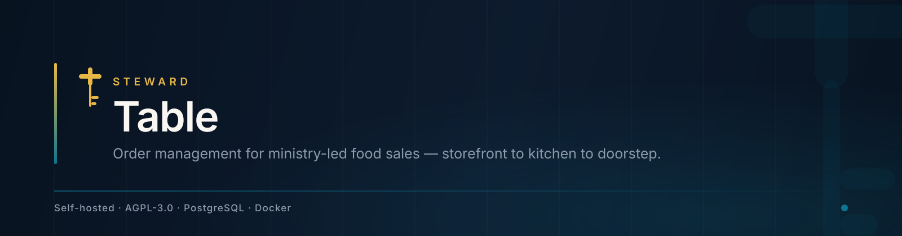
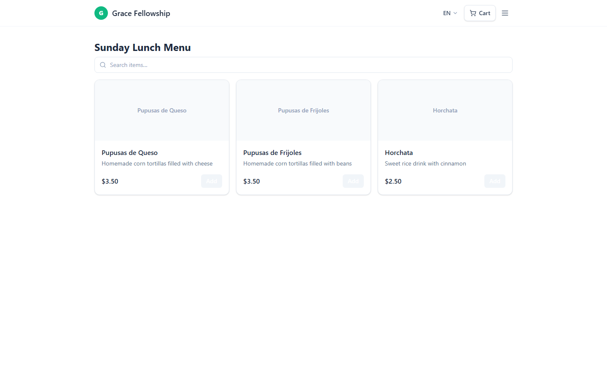
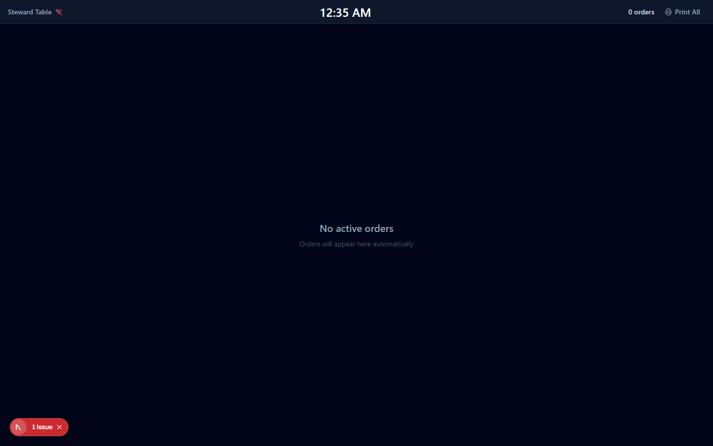
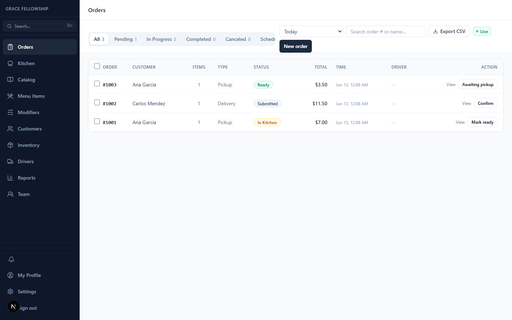

<div align="center">



<br><br>

<a href="https://github.com/24Skater/steward-table/actions/workflows/ci.yml"></a>
<a href="LICENSE"></a>


<br><br>

**[Quick start](#quick-start)** &nbsp;·&nbsp;
**[What it does](#what-it-does)** &nbsp;·&nbsp;
**[Architecture](#architecture)** &nbsp;·&nbsp;
**[Status](#status)** &nbsp;·&nbsp;
**[Docs](#documentation)**

</div>

<br>

Order management for churches that sell food. A pupusa sale, a fundraiser
dinner, a coffee hour — the kind of thing that usually runs on a paper list, a
group chat, and one volunteer holding the whole picture in their head.

Steward Table gives the kitchen, the cashier and the drivers one shared view of
the same orders, and gives the customer a checkout that needs no app and no
account.

<br>

<div align="center">
  
  <br>
  <sub><b>The storefront a customer sees.</b> Guest checkout — no download, no account.</sub>
</div>

<br>

---

## What it does

<table>
<tr>
<td width="33%" valign="top">

 **Storefront**

Public menu per church, guest checkout, English and Spanish on every
customer-visible string.

</td>
<td width="33%" valign="top">

 **Kitchen display**

Real-time order cards, urgency colouring, wakelock so the tablet does not sleep
mid-rush.

</td>
<td width="33%" valign="top">

 **Delivery**

Driver assignment, zone-based routing, status the customer can follow.

</td>
</tr>
<tr>
<td width="33%" valign="top">

 **Order lifecycle**

Thirteen states from `DRAFT` through `COMPLETED` and `REFUNDED`, with an
immutable audit trail.

</td>
<td width="33%" valign="top">

 **Payments**

The church brings its own Stripe keys and owns its money. Stripe Connect is
opt-in, not the default.

</td>
<td width="33%" valign="top">

 **Inventory**

Finished-goods tracking that reserves on order and restocks on cancellation,
without anyone remembering to.

</td>
</tr>
</table>

<div align="center">
<table>
<tr>
<td align="center" width="50%">
<br>
<sub><b>Kitchen display</b></sub>
</td>
<td align="center" width="50%">
<br>
<sub><b>Order dashboard</b></sub>
</td>
</tr>
</table>
</div>

---

## Quick start

**Requirements:** Docker and Docker Compose. Nothing else — Postgres and MinIO
come up in the stack.

```bash
git clone https://github.com/24Skater/steward-table.git
cd steward-table

# Start with demo data and a login that already works
docker compose -f docker/docker-compose.yml --profile demo up -d --build

# http://localhost:3001  —  owner@gracefellowship.demo / demo1234
```

Migrations run on their own: the `migrate` service applies them and the app
waits for it before starting.

<details>
<summary>Start empty instead, or run it without Docker</summary>

**Empty instance.** Drop the demo profile:

```bash
docker compose -f docker/docker-compose.yml up -d --build
```

There is then no account to sign in with. Create the first one with
`pnpm db:seed` against the database, or bring the stack up once with
`--profile demo`.

**Local Node.** Requires Node 20+, pnpm, and a PostgreSQL 16 you provide:

```bash
pnpm install
cp .env.example .env.local        # set DATABASE_URL at minimum
pnpm prisma migrate dev
pnpm dev                          # http://localhost:3000
```

Note the port: Docker publishes on **3001**, `pnpm dev` serves on **3000**.

</details>

<details>
<summary>Deploy to Vercel</summary>

[](https://vercel.com/new/clone?repository-url=https://github.com/24Skater/steward-table)

Set the variables from `.env.example` in the Vercel project settings. You still
need a PostgreSQL instance and S3-compatible storage — Vercel provides neither.

</details>

---

## Configuration

Full list in [`.env.example`](.env.example). These are the ones that decide
whether the app works.

| Variable | Required | Default | What it does |
| --- | :--: | --- | --- |
| `DATABASE_URL` | yes | — | PostgreSQL 16 connection string |
| `NEXTAUTH_SECRET` | yes | — | Session signing key — `openssl rand -base64 32` |
| `NEXTAUTH_URL` | yes | — | The app's own public URL |
| `AUTH_TRUST_HOST` | on CI | `true` | Required behind a proxy and on CI runners |
| `ENCRYPTION_KEY` | for Stripe | — | AES-256-GCM key for stored church API keys |
| `GOOGLE_CLIENT_ID` / `_SECRET` | no | — | Google sign-in |
| `RESEND_API_KEY` | no | — | Emailed sign-in links and receipts |
| `R2_*` | no | — | S3-compatible image storage; MinIO locally |
| `TWILIO_*` | no | — | SMS order notifications |

With none of the optional providers set, email and password is the only way in.

---

## Architecture

```
        Customer                Volunteers                  Drivers
            │                       │                          │
   ┌────────▼────────┐   ┌──────────▼─────────┐   ┌───────────▼────────┐
   │   (storefront)  │   │  (dashboard)       │   │  assigned orders   │
   │  guest checkout │   │  (kitchen) display │   │  + status updates  │
   └────────┬────────┘   └──────────┬─────────┘   └───────────┬────────┘
            └───────────────┬───────┴─────────────────────────┘
                            │
                 ┌──────────▼──────────┐
                 │   Next.js 15 app    │
                 │  tenancy guard on   │
                 │  every Prisma call  │
                 └──────────┬──────────┘
                            │
        ┌───────────────────┼───────────────────┐
        │                   │                   │
  ┌─────▼─────┐   ┌─────────▼────────┐   ┌──────▼──────┐
  │ Postgres  │   │ LISTEN/NOTIFY    │   │ S3 / MinIO  │
  │    16     │──▶│      → SSE       │   │   images    │
  └───────────┘   └──────────────────┘   └─────────────┘
```

**The tenancy guard throws; it does not inject.** A Prisma query against a
tenanted model with no `churchId` raises rather than quietly returning every
church's rows. An injecting guard would silently change what a query means; a
throwing one makes the caller say what they meant. Models are classified in
three sets and a test checks those sets against Prisma's DMMF, so a new model
cannot skip classification without failing CI.

**Realtime is Postgres, not a second service.** `LISTEN/NOTIFY` feeds
server-sent events. There is no Redis and no websocket server to operate.

**The church holds its own Stripe keys**, encrypted with AES-256-GCM in the
`ApiKey` table. Money moves between the congregation and the church, never
through us.

Full reasoning in [`docs/MULTI-TENANCY.md`](docs/MULTI-TENANCY.md).

### Roles

Six, with admin-chain inheritance — OWNER supersedes ADMIN supersedes STAFF.

| Role | Can do |
| --- | --- |
| `OWNER` | Everything, including billing and deleting the church |
| `ADMIN` | Day-to-day administration; inherits STAFF |
| `STAFF` | Take orders, serve customers, refund up to a cap |
| `COOK` | Kitchen display only; mark ready, adjust inventory |
| `DRIVER` | Their own assigned orders, and nothing else |
| `VIEWER` | Aggregated reports, with no customer PII |

Every permission denial is written to the audit log.

### Stack

| Layer | Choice |
| --- | --- |
| Framework | Next.js 15, App Router |
| Language | TypeScript, strict |
| UI | Tailwind CSS, shadcn/ui, lucide-react |
| Auth | Auth.js v5 |
| Database | PostgreSQL 16 via Prisma 6 |
| Payments | Stripe — church-owned keys by default |
| Storage | S3-compatible: Cloudflare R2, or MinIO self-hosted |
| Realtime | Postgres `LISTEN/NOTIFY` → SSE |
| Email / SMS | Resend or SMTP · Twilio, optional |
| Testing | Vitest, Playwright |
| Tooling | pnpm, Biome |

---

## Status

Pre-production. No paying churches and no live congregational data yet, which is
said plainly because it is the thing a church most needs to know before trusting
it with an order book.

**Working and verified end to end:** storefront and guest checkout, the order
state machine, kitchen display, driver assignment, role enforcement including
the deny log, inventory reserve and restock, multi-tenant isolation with
cross-tenant writes refused, and English/Spanish on customer-visible copy.

**Not yet proven:** Stripe has never run a live test-mode checkout here. Payment
configuration exists and is unexercised.

**Known limits:** SMS requires a Twilio account you pay for. The app has not been
run against more than a handful of churches on one deployment.

---

## The Steward family

Steward is four applications on one design system. Each one runs standalone and
self-hosted — nothing here requires the others, or us.

| Application | What it does |
| --- | --- |
| **[Congregation](https://github.com/24Skater/StewardChMS)** | Members, giving, worship planning, reporting |
| **[StewardPOS](https://github.com/24Skater/stewardpos)** | Point of sale, inventory, returns |
| **[Table](https://github.com/24Skater/steward-table)** | Food orders, kitchen display, delivery |
| **[VBS](https://github.com/24Skater/StewardVBS)** | Registration, check-in, reporting |

They share one design system — [Steward Brand](https://github.com/24Skater/steward-brand),
the tokens, components and icons every screen is built from.

---

## Documentation

| Document | What is in it |
| --- | --- |
| [`docs/MULTI-TENANCY.md`](docs/MULTI-TENANCY.md) | The tenancy guard, model classification, host resolution |
| [`CLAUDE.md`](CLAUDE.md) | Schema gotchas, RBAC action strings, the load-bearing casts |
| [`.env.example`](.env.example) | Every environment variable |
| [`CONTRIBUTING.md`](CONTRIBUTING.md) | Development setup and conventions |

---

## Security

Report vulnerabilities privately — see [`SECURITY.md`](SECURITY.md). Please do
not open a public issue for one.

What the app does on its own behalf: church Stripe credentials are encrypted at
rest with AES-256-GCM and never stored in plaintext settings; every permission
denial is recorded; the tenancy guard fails closed, refusing a query rather than
widening it.

---

## Contributing

External pull requests are paused pending LLC formation and CLA infrastructure.
Issues and discussion are welcome now, and the pause is about paperwork rather
than interest. See [`CONTRIBUTING.md`](CONTRIBUTING.md).

---

## Licence

Dual-licensed:

- **[AGPL-3.0](LICENSE)** for open-source use
- **[Commercial](COMMERCIAL_LICENSE.md)** for organisations that cannot comply with AGPL-3.0

Copyright (c) 2026 Steward. Entity formation pending.
